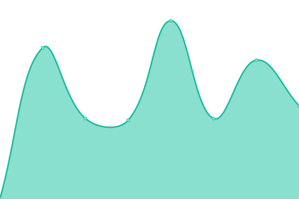
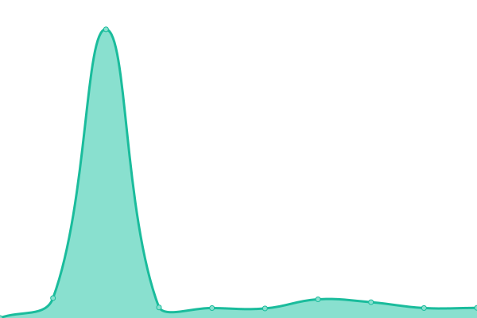
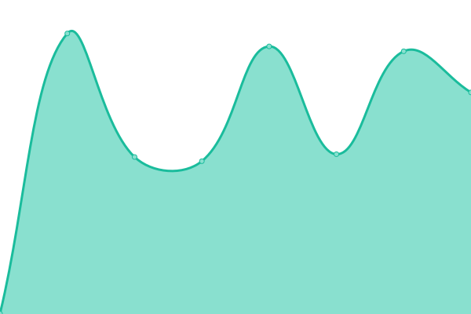

# [📈 Live Status](https://alfonso100.github.io/furry-octo-enigma): <!--live status--> **🟩 All systems operational**

This repository contains the open-source uptime monitor and status page for [Alfonso Catron](http://alfonsocatron.com/), powered by [Upptime](https://github.com/upptime/upptime).

With [Upptime](https://upptime.js.org), you can get your own unlimited and free uptime monitor and status page, powered entirely by a GitHub repository. We use [Issues](https://github.com/alfonso100/furry-octo-enigma/issues) as incident reports, [Actions](https://github.com/alfonso100/furry-octo-enigma/actions) as uptime monitors, and [Pages](https://alfonso100.github.io/furry-octo-enigma) for the status page.

<!--start: status pages-->
<!-- This summary is generated by Upptime (https://github.com/upptime/upptime) -->
<!-- Do not edit this manually, your changes will be overwritten -->
<!-- prettier-ignore -->
| URL | Status | History | Response Time | Uptime |
| --- | ------ | ------- | ------------- | ------ |
|  [WP-Rocket.me](https://wp-rocket.me) | 🟩 Up | [wp-rocket-me.yml](https://github.com/alfonso100/furry-octo-enigma/commits/HEAD/history/wp-rocket-me.yml) | 

 247ms
     
 | 

<a href="https://alfonso100.github.io/furry-octo-enigma/history/wp-rocket-me">100.00%</a>
    

|  [WP-Rocket - License Validation](https://wp-rocket.me/valid_key.php) | 🟩 Up | [wp-rocket-license-validation.yml](https://github.com/alfonso100/furry-octo-enigma/commits/HEAD/history/wp-rocket-license-validation.yml) | 

 119ms
     
 | 

<a href="https://alfonso100.github.io/furry-octo-enigma/history/wp-rocket-license-validation">99.41%</a>
    

|  [RocketCDN.com](https://rocketcdn.me/) | 🟩 Up | [rocket-cdn-com.yml](https://github.com/alfonso100/furry-octo-enigma/commits/HEAD/history/rocket-cdn-com.yml) | 

 581ms
     
 | 

<a href="https://alfonso100.github.io/furry-octo-enigma/history/rocket-cdn-com">100.00%</a>
    

|  [SaaS - Remove Unused CSS generation service (CPCSS)](https://central-saas.wp-rocket.me/) | 🟩 Up | [saa-s-remove-unused-css-generation-service-cpcss.yml](https://github.com/alfonso100/furry-octo-enigma/commits/HEAD/history/saa-s-remove-unused-css-generation-service-cpcss.yml) | 

 194ms
     
 | 

<a href="https://alfonso100.github.io/furry-octo-enigma/history/saa-s-remove-unused-css-generation-service-cpcss">100.00%</a>
    

|  [SaaS - Critical Path CSS generation service (CPCSS)](https://cpcss.wp-rocket.me/ui) | 🟩 Up | [saa-s-critical-path-css-generation-service-cpcss.yml](https://github.com/alfonso100/furry-octo-enigma/commits/HEAD/history/saa-s-critical-path-css-generation-service-cpcss.yml) | 

 648ms
     
 | 

<a href="https://alfonso100.github.io/furry-octo-enigma/history/saa-s-critical-path-css-generation-service-cpcss">100.00%</a>
    

|  [Imagify.io](https://imagify.io/) | 🟩 Up | [imagify-io.yml](https://github.com/alfonso100/furry-octo-enigma/commits/HEAD/history/imagify-io.yml) | 

 644ms
     
 | 

<a href="https://alfonso100.github.io/furry-octo-enigma/history/imagify-io">100.00%</a>
    

<!--end: status pages-->

[**Visit our status website →**](https://alfonso100.github.io/furry-octo-enigma)

## 📄 License

- Powered by: [Upptime](https://github.com/upptime/upptime)
- Code: [MIT](./LICENSE) © [Alfonso Catron](http://alfonsocatron.com/)
- Data in the `./history` directory: [Open Database License](https://opendatacommons.org/licenses/odbl/1-0/)
